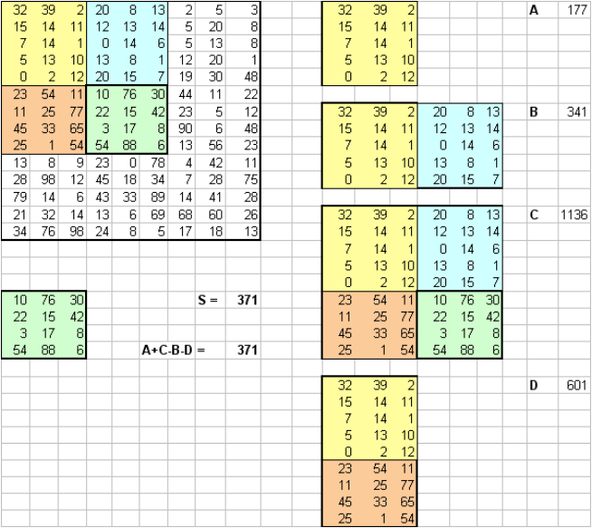

# **[Про интегральное представление изображения](https://robocraft.ru/computervision/536?ysclid=lqfl68zjmd612736521)**

## **5.1 Постановка задачи**

Каждое чёрно-белое (обесцвеченное) изображение можно представить в виде матрицы, состоящей из одних лишь чисел – контрастности конкретного пикселя. А интегральное представление изображения – это матрица размерность которой совпадает с размерностью исходного изображения. Элементы этой матрицы можно рассчитать по формулам:
 
$II(x, y) = ∑I(i, j)$

$II(x, y) = I(x, y) - II(x - 1, y - 1) - II(x - 1, y) - II(x, y - 1)$

* *𝐼(𝐼,𝑗)* – яркость пикселя исходного изображения,
* *𝐼𝐼(𝑥, 𝑦)* – элемент интегрального изображения, содержащий себе сумму пикселей изображения в прямоугольнике от (0,0) до (x,y).

Одной из полезнейших особенностей интегрального представления 
является возможность очень быстро вычислить сумму пикселей произвольного 
прямоугольника (или любой другой фигуры, которую можно аппроксимировать 
несколькими прямоугольниками). Сумму внутри прямоугольника можно 
выразить через суммы и разности смежных (рисунок 5.1) прямоугольников по формуле:

$SumOfRect(ABCD) = II(A) + II(C) - II(B) - II(D)$

* *А* – прямоугольник в левом верхнем углу,
* *B* – все прямоугольники верхнего ряда,
* *C* – все прямоугольники,
* *D* – все прямоугольники левой колонки.

Необходимо написать две функции:
* первая будет осуществлять расчёт матрицы интегрального представления 
изображения;
* вторая будет находить сумму пикселей произвольного прямоугольника, 
ограниченного заданными пикселями.



Пример суммы пикселей в произвольном прямоугольнике можно увидеть на рисунке выше.

## **5.2 Входные данные**

На вход каждая функция получает матрицу целых чисел, где каждый элемент – яркость пикселя исходного изображения. Так как осуществлять такой ввод весьма неприятно, можете написать вспомогательную функцию для генерации такой матрицы из целых чисел в диапазоне от 0 до 255. На вход второй функции дополнительно подаются координаты выделенного прямоугольника, сумму которого вам необходимо вычислить. Первые два числа – *x1* и *y1* – координаты верхнего левого угла прямоугольника, а остальные – *x2* и *y2* – координаты нижнего правого угла прямоугольника.

## **5.3 Сигнатуры функций**

Функции обязательно должны соответствовать определённым сигнатурам, 
представленным на листингах 5.1-5.2.

Листинг 5.1 – Сигнатура первой функции

```python
def integral_view (image: List[List]) -> List[List]:
```

Листинг 5.2 – Сигнатура второй функции

```python
def rect_sum (image: List[List], x1: int, y1: int, x2: int, y2: int) -> int:
```

## **Требования**
Программа должна быть:

* [X] Программа должна быть выполнена на языке Python
* [X] Программа должна быть устойчива к вводу некорректных значений
* [X] Ввод значений происходит с клавиатуры. 

## **Описание программы**

В программе реализованы 3 функции: `generate_matrix`, `integral_view` и `rect_sum`

Функция `generate_matrix` создает матрицу произвольного размера

```python
return [[randint(0, 255) for _ in range(width)] for _ in range(height)]
```
Функция `integral_view` рассчитывает матрицу интегрального представления изображения, где каждый элемент вычисляется по формуле: 

$II(x, y) = I(x, y) - II(x - 1, y - 1) - II(x - 1, y) - II(x, y - 1)$

```python
    height = len(image)
    width = len(image[0])
    integral_image = [[0] * width for _ in range(height)]
    for x in range(width):
    for y in range(height):
        value_1 = image[y][x]
        value_2 = integral_image[y - 1][x - 1] if y > 0 and x > 0 else 0
        value_3 = integral_image[y][x - 1] if x > 0 else 0
        value_4 = integral_image[y - 1][x] if y > 0 else 0
        integral_image[y][x] = value_1 + value_4 + value_3 - value_2
    return integral_image
```

Функция `rect_sum` находит сумму пикселей произвольного прямоугольника матрицы изображения, по формуле:

$SumOfRect(ABCD) = II(A) + II(C) - II(B) - II(D)$

```python
    rect_a = integral_image[y1 - 1][x1 - 1] if y1 > 0 and x1 > 0 else 0
    rect_b = integral_image[y1 - 1][x2] if y1 > 0 else 0
    rect_c = integral_image[y2][x2]
    rect_d = integral_image[y2][x1 - 1] if x1 > 0 else 0
    return rect_a + rect_c - rect_b - rect_d
```
